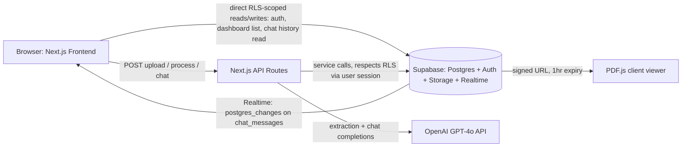
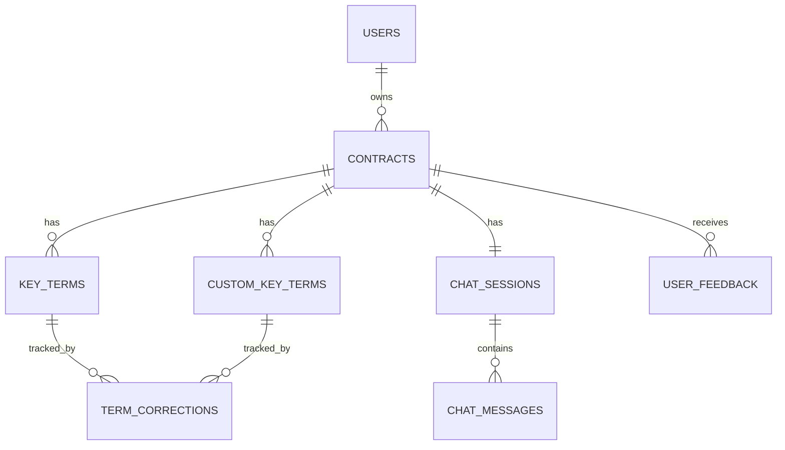

# ContractIQ — Engineering Document (High-Level Design)

**Source:** `docs/ContractIQ_PRD.md` (v1.0, June 24 2026)
**Status:** Draft — pending approval (Stage 1 of build workflow)
**Owner:** Engineering

This document is the authoritative technical reference for ContractIQ. No implementation begins until it is approved. It is followed by `docs/engineering/implementation-specs.md` (per-feature specs) and, once both are approved, `docs/specs/*` (Stage 2 — granular runnable specs + `supabase-schema.sql` + `.env.example`).

---

## 1. Executive Summary

**Project:** ContractIQ — an AI-assisted NDA/MSA contract review tool.

**Business goal:** Let SMBs and freelancers without in-house legal counsel understand contract terms in minutes instead of hours, without a lawyer on call.

**Problem statement:** Reviewing a single NDA or MSA manually takes 90–120 minutes and requires legal expertise most SMBs don't have. Existing tools are either built for enterprise legal teams (DocuSign CLM, Ironclad) or produce generic, unattributed summaries (ChatGPT) with no page-level traceability or confidence signal.

**Target users:**
- **Primary:** Time-pressed Founder / Ops Lead — 5–15 NDA/MSA signings per month, no in-house legal.
- **Secondary:** Freelancer / Consultant — 1–4 MSAs per month from larger clients, no legal budget.

**Success criteria (MVP):**
- Upload → completed key-term review in ≤ 15 minutes (baseline: 90 min manual).
- Key-term extraction ≥ 88% F1 (NDA), ≥ 85% F1 (MSA).
- Time to first extracted term ≤ 30s P95 (≤ 20-page contracts).
- Cost per analysis ≤ $0.25.
- 30-day retention ≥ 45%, NPS ≥ 40.

---

## 2. Product Scope

### In scope (MVP, v0.1–v1.0)
- Email/password auth (Supabase Auth).
- PDF upload (≤ 10 MB, ≤ 20 pages, ≤ 15,000 tokens) with server-side text extraction.
- Standard key-term extraction for NDA and MSA contract types (GPT-4o, few-shot, JSON mode).
- Up to 5 custom key terms per analysis.
- Confidence scoring (0–100%) with low-confidence (< 50%) flagging.
- Page-number attribution + source-sentence explainability per term.
- Inline PDF viewer (PDF.js) with text-viewer fallback.
- Inline term correction.
- Contract chat (Q&A), grounded strictly in document text, with page citations.
- Persistent chat history per contract.
- Dashboard with contract history.
- Thumbs-up/down feedback with optional comment.

### Out of scope (MVP)
- Scanned/image PDFs (OCR) — deferred to v1.2.
- Non-English contracts / non-US-UK legal conventions — deferred, tracked as a fairness gap.
- Contract types other than NDA/MSA.
- Export to CSV/PDF — v1.1.
- Batch upload — v1.1.
- Multi-user/team workspaces — v1.2.
- Contract comparison view — v1.2.
- Email notifications — v1.2.

### Future enhancements
- v1.1: CSV/PDF export, batch upload (≤ 5 contracts), dashboard analytics.
- v1.2: OCR (AWS Textract or equivalent), contract comparison, team plans, email notifications.

---

## 3. User Personas

At MVP there is a **single role type**: authenticated end user. No admin, support, or team-workspace roles exist (team workspace is v1.2 and out of scope here).

| Persona | Responsibilities | Permissions | Primary Workflow |
|---|---|---|---|
| **Founder / Ops Lead** | Uploads company contracts, reviews extracted terms, corrects errors, asks chat questions | Full CRUD on own contracts, key terms, chat sessions, feedback (enforced via RLS on `user_id`) | Flow 3 (Contract Review) → Flow 4 (Chat) |
| **Freelancer / Consultant** | Uploads client-sent MSAs, checks for non-standard/risky clauses | Same as above | Flow 3 → correction of risky terms |

All permissions are enforced at the database layer via Supabase Row-Level Security — there is no separate authorization middleware layer (see §6, §7).

---

## 4. User Flows

Format: `User Action → Frontend Behavior → Backend Processing → Database Interaction → System Response`

### Flow 1 — Sign Up → Dashboard
```
1. User clicks "Get Started Free"
   → Frontend opens Supabase Auth sign-up modal (email + password)
   → Backend: Supabase Auth creates auth.users row, sends verification email
   → DB: auth.users row created; no app tables written yet
   → System: redirect to /dashboard on success; empty state shown

2. User verifies email (if enforced) and lands on Dashboard
   → Frontend: GET dashboard summary query (TanStack Query)
   → Backend: Supabase client reads directly (no API route needed — RLS-protected read)
   → DB: SELECT count(*) FROM contracts WHERE user_id = auth.uid() → 0
   → System: "No contracts reviewed yet — upload your first contract to begin"
```

### Flow 2 — Sign In → Dashboard
```
1. User submits email/password
   → Frontend: Supabase Auth signInWithPassword()
   → Backend: Supabase Auth validates credentials, issues session (JWT + refresh token)
   → DB: none (auth-only)
   → System: on success, redirect to /dashboard within 10s; on failure, inline error

2. Dashboard loads
   → Frontend: parallel TanStack Query calls for summary + recent contracts
   → Backend: Supabase client direct read (RLS-scoped)
   → DB: SELECT ... FROM contracts WHERE user_id = auth.uid() ORDER BY created_at DESC LIMIT 5
   → System: summary card (total contracts, breakdown by type) + recent list + "Review a Contract" CTA
```

### Flow 3 — Core: Contract Review
```
1. User selects contract type (NDA/MSA), uploads PDF (drag-drop or file-pick)
   → Frontend: client-side validation (≤10MB, PDF mime type) before upload
   → Backend API: POST /api/contracts/upload
       - streams file to Supabase Storage (contracts/{user_id}/{contract_id}/{filename}.pdf) [non-blocking]
       - runs pdf-parse server-side, inserts [PAGE N] markers
       - rejects if extracted text < 100 words ("Scanned PDFs are not supported yet")
       - rejects if > 20 pages or > 15,000 tokens
   → DB: INSERT INTO contracts (user_id, contract_type, contract_text, file_path, status='uploaded')
   → System: pre-processing preview card shows the standard term list for the selected contract type

2. User optionally adds up to 5 custom terms
   → Frontend: Zustand upload-wizard store holds draft custom terms client-side
   → Backend: none yet (terms are submitted with the process request)
   → DB: none yet
   → System: custom terms appear in preview list with "Custom" badge

3. User clicks "Process Contract"
   → Frontend: progress indicator (extracting → analysing → compiling), POST /api/contracts/{id}/process
   → Backend API: builds few-shot prompt (contract_type + custom terms), calls OpenAI GPT-4o (JSON mode, temp 0.1),
       validates/parses JSON, retries once on parse failure, retries OpenAI errors 3x with backoff
   → DB: INSERT INTO key_terms (...) per term; INSERT INTO custom_key_terms (...) for custom entries;
       UPDATE contracts SET status = 'complete' (or 'error')
   → System: Results page — PDF viewer (left) + key terms panel (right), color-coded confidence

4. User clicks a term's page number
   → Frontend: PDF viewer / text-viewer fallback receives targetPage prop, smooth-scrolls + highlights
   → Backend/DB: none (client-side only)
   → System: page in view scrolls into frame with highlighted span

5. User edits an extracted term inline
   → Frontend: optimistic update via TanStack Query mutation, PATCH /api/key-terms/{id}
   → Backend API: validates payload, writes correction
   → DB: UPDATE key_terms SET value = ?, is_edited = true, original_value preserved;
       INSERT INTO term_corrections (for feedback loop)
   → System: "Edited" badge shown; save completes within 2s
```

### Flow 4 — Chat with Contract
```
1. User opens "Chat with Contract" and types a question
   → Frontend: POST /api/contracts/{id}/chat with message text; optimistic render of user bubble
   → Backend API: fetches contract_text + up to 200 prior messages (ascending) from DB,
       classifies query (contract / history / both), builds system prompt
       ("answer only from the document text provided..."), calls GPT-4o (temp 0.4, max 1000 tokens)
   → DB: INSERT INTO chat_messages (role='user', ...); INSERT INTO chat_messages (role='assistant', ...);
       ensures a chat_sessions row exists for the contract
   → System: response streamed/rendered within 15s P95, includes mandatory "[Page X]" citation

2. Any open tab/device for the same contract
   → Frontend: Supabase Realtime subscription on chat_messages filtered by session_id
   → Backend: Supabase Realtime (Postgres changes) — no extra API call
   → DB: none beyond the write in step 1
   → System: new messages appear live without a manual refresh
```

---

## 5. Frontend Architecture

**Stack:** Next.js 14 (App Router, fixed per project convention) + TypeScript + Tailwind CSS.

**State management:**
- **TanStack Query** — all server state: contract list, contract detail, key terms, chat messages, dashboard summary. Query keys namespaced by resource + id (e.g. `['contract', contractId]`, `['keyTerms', contractId]`, `['chatMessages', contractId]`). Mutations use optimistic updates for inline term edits and chat sends.
- **Zustand** — ephemeral client/UI state only: upload wizard step, draft custom terms before submission, modal open/close, PDF viewer zoom/page state. Never stores server data that TanStack Query already owns (avoids dual-source-of-truth bugs).
- **Supabase Realtime** — subscribes to `chat_messages` changes per open contract session; pushes into the TanStack Query cache via `queryClient.setQueryData` rather than a separate store.

**UX states (required for every data-driven view):**
| State | Handling |
|---|---|
| Loading | Skeleton loaders for dashboard rows, key-terms panel, chat bubbles |
| Empty | Dashboard empty state copy; "no chat messages yet" prompt |
| Error | Human-readable error + retry CTA (upload failure, OpenAI timeout, network) — no silent failures |
| Responsive | Two-panel results layout collapses to tabbed view (PDF / Key Terms) under 768px |
| Accessibility | WCAG 2.1 AA: color-coded confidence always paired with text/icon (not color alone), keyboard-navigable PDF viewer controls, focus traps in modals |

**Page hierarchy:**
```
app/
├─ (marketing)/page.tsx                 — landing page (static)
├─ (auth)/sign-in/page.tsx
├─ (auth)/sign-up/page.tsx
├─ (app)/dashboard/page.tsx             — summary + contract list
├─ (app)/contracts/upload/page.tsx      — contract type + upload + preview + custom terms
├─ (app)/contracts/[id]/page.tsx        — results: PDF viewer + key terms panel + chat tab
├─ (app)/contracts/[id]/loading.tsx
└─ layout.tsx                            — auth guard, providers (QueryClient, Supabase, Zustand)
```

**Component hierarchy (key components):**
```
<ResultsPage>
├─ <ContractViewer>            (PDF.js primary / <TextViewerFallback> when Storage unavailable)
├─ <KeyTermsPanel>
│  ├─ <KeyTermRow>             (name, value, page, confidence badge, "Why?" expandable)
│  └─ <AddCustomTermButton>    (pre-processing only)
├─ <ChatPanel>
│  ├─ <ChatMessageList>        (subscribes to Realtime)
│  ├─ <ChatInput>
│  └─ <SourceCitationLink>     ([Page X] → scrolls viewer)
└─ <DisclaimerBanner>          ("Not legal advice")
```

---

## 6. Backend Architecture

**Stack:** Next.js API Routes (Route Handlers under `app/api/**/route.ts`) — chosen over Supabase Edge Functions and a standalone Node service to keep a single Vercel deployment, avoid a second CI/CD pipeline, and keep the OpenAI API key exclusively server-side (never shipped to the client bundle).

**Core systems:**
- **Auth:** Supabase session cookie validated in Next.js middleware (`middleware.ts`) for all `(app)` routes and all `/api/**` routes except auth callbacks. No custom JWT logic — delegated entirely to Supabase.
- **Authorization:** No app-level authorization layer. All data access is scoped by Postgres RLS keyed on `auth.uid() = user_id`. API routes use the request-scoped Supabase server client (respects RLS) for all reads/writes — service-role key is never used in request-handling code paths.
- **Business logic (thin orchestration only, per PRD's explicit constraint):**
  - Upload route: file validation → Storage write (non-blocking) → pdf-parse → DB insert.
  - Process route: prompt construction → OpenAI call → JSON validation/retry → DB insert.
  - Chat route: history fetch → query classification → OpenAI call → DB insert.
- **Validation:** Zod schemas per route (file size/type, contract_type enum, custom term count ≤ 5, message length).
- **Error handling:** Uniform `{ error: { code, message } }` response shape; OpenAI errors get 3-retry exponential backoff before surfacing; contract `status` set to `'error'` on unrecoverable failure so the user can retry without re-uploading.
- **Rate limiting:** Per-user token-bucket limiter (in `lib/security` per Stage 3) on `/api/contracts/*/process` and `/api/contracts/*/chat` to protect the OpenAI cost ceiling.

**Service interaction diagram:**



---

## 7. Database Design and Schema

Single Supabase Postgres project. All tables carry `user_id uuid references auth.users(id)` (directly or transitively via `contract_id`) and RLS policies restricting access to `auth.uid() = user_id`.

### `contracts`
| Column | Type | Notes |
|---|---|---|
| id | uuid, PK, default gen_random_uuid() | |
| user_id | uuid, FK → auth.users(id) | not null |
| contract_type | text | enum: `'NDA'`, `'MSA'` |
| file_path | text, nullable | Storage path `contracts/{user_id}/{contract_id}/{filename}.pdf`; null if Storage write failed (non-blocking) |
| contract_text | text | full extracted text with `[PAGE N]` markers; single source of truth for processing + chat |
| status | text | enum: `'uploaded'`, `'processing'`, `'complete'`, `'error'` |
| page_count | int | |
| token_count | int | for the ≤15,000-token MVP ceiling |
| created_at | timestamptz, default now() | |
| last_accessed_at | timestamptz | drives 90-day retention auto-delete |

Indexes: `(user_id)`, `(user_id, created_at desc)`.

### `key_terms`
| Column | Type | Notes |
|---|---|---|
| id | uuid, PK | |
| contract_id | uuid, FK → contracts(id) | on delete cascade |
| term_name | text | |
| value | text | current (possibly corrected) value |
| original_value | text | AI's original output, preserved for feedback loop |
| page_number | int | 1-indexed |
| confidence_score | numeric(5,2) | 0–100 |
| source_sentence | text | verbatim sentence supporting the extraction |
| is_edited | boolean, default false | |
| is_manual | boolean, default false | true for custom terms merged into this table, or kept separate — see `custom_key_terms` |
| created_at | timestamptz | |

Indexes: `(contract_id)`.

### `custom_key_terms`
| Column | Type | Notes |
|---|---|---|
| id | uuid, PK | |
| contract_id | uuid, FK → contracts(id) | |
| term_name | text | user-defined, max 5 per contract (enforced at API layer) |
| value / page_number / confidence_score / source_sentence | same as `key_terms` | |
| is_manual | boolean, default true | |

Indexes: `(contract_id)`.

### `chat_sessions`
| Column | Type | Notes |
|---|---|---|
| id | uuid, PK | |
| contract_id | uuid, FK → contracts(id), unique | one session per contract at MVP |
| user_id | uuid, FK → auth.users(id) | denormalized for RLS simplicity |
| created_at | timestamptz | |

### `chat_messages`
| Column | Type | Notes |
|---|---|---|
| id | uuid, PK | |
| session_id | uuid, FK → chat_sessions(id) | on delete cascade |
| role | text | enum: `'user'`, `'assistant'` |
| content | text | |
| page_citation | int, nullable | parsed `[Page X]` for assistant messages |
| created_at | timestamptz | ascending order = conversation order; up to 200 fetched per turn |

Indexes: `(session_id, created_at)`.

### `user_feedback`
| Column | Type | Notes |
|---|---|---|
| id | uuid, PK | |
| user_id | uuid, FK → auth.users(id) | |
| contract_id | uuid, FK → contracts(id) | |
| rating | text | enum: `'up'`, `'down'` |
| comment | text, nullable | |
| created_at | timestamptz | |

### `term_corrections` (feedback/eval loop)
| Column | Type | Notes |
|---|---|---|
| id | uuid, PK | |
| key_term_id | uuid, FK → key_terms(id), nullable | nullable to also cover custom_key_terms corrections |
| custom_key_term_id | uuid, FK → custom_key_terms(id), nullable | |
| original_value | text | |
| corrected_value | text | |
| corrected_at | timestamptz | drives the "12% correction rate in any 7-day window" alert |

**Storage:** bucket `contracts`, path pattern `contracts/{user_id}/{contract_id}/{filename}.pdf`; RLS policies restrict `INSERT`/`SELECT`/`DELETE` to `auth.uid()::text = (storage.foldername(name))[1]`. Bucket + policies created via SQL (`INSERT INTO storage.buckets`, `CREATE POLICY ON storage.objects`) — never via dashboard, so the full setup ships as one paste-and-run file (Stage 2 deliverable: `supabase-schema.sql`).

**ERD (simplified):**


---

## 8. AI Architecture

| Aspect | Detail |
|---|---|
| Provider / model | OpenAI GPT-4o via OpenAI API |
| Context window | ≥ 128k tokens (contract ≤ 15,000 tokens + prompt + history headroom) |
| Response format | JSON mode (`response_format: { type: "json_object" }`) for extraction |
| Max output tokens | 2,000 (extraction), 1,000 (chat) |
| Temperature | 0.1 (extraction, deterministic), 0.4 (chat, natural but grounded) |
| Latency budget | ≤ 20s per call P95; combined UX target ≤ 30s (extraction) / ≤ 15s (chat) |
| Cost ceiling | ≤ $0.20/analysis extraction, ≤ $0.25/analysis total (20-page contract) |

**Prompt strategy:**
- Extraction: few-shot (3 NDA + 3 MSA labelled examples in system prompt); JSON array output `[{term_name, value, page_number, confidence_score, source_sentence}]`; custom terms injected zero-shot into the same schema.
- Confidence scoring: self-reported by the model within the same inference call (no second pass).
- Chat: full-document context (no chunking/vector retrieval at MVP — contract ≤ 15k tokens fits fully in context every turn), system prompt enforces "answer only from the document text provided; if not present, say so"; full conversation history (≤ 200 messages, ascending) passed every turn; a lightweight query-classification step (`contract` / `history` / `both`) adjusts system prompt/context without a separate API call.
- Error recovery: one automatic retry with an explicit "return only valid JSON" instruction if parsing fails; 3-attempt exponential backoff on OpenAI transport/rate-limit errors before surfacing a user-facing error.

**Guardrails (see PRD §9 for full detail — summarized for architecture purposes):**
- Confidence < 50% → non-dismissible ⚠️ warning, term still shown (never hidden).
- Every term requires a `source_sentence`; absence is treated as unreliable.
- Every chat response requires a `[Page X]` citation; automated regression test asserts "I cannot find this in the document" for out-of-scope questions.
- Monthly calibration monitoring (predicted vs. observed confidence); UI warning if miscalibration ≥ 15%.

**Cost/rate controls:** per-user rate limiting on process/chat endpoints (Stage 3 security foundation); monthly usage monitored against the $0.25/analysis ceiling with 80%-of-budget alerting.

**Fallback:** if GPT-4o F1 falls short of target or pricing rises > 30%, Claude 3.5 or Gemini 1.5 Pro are the evaluated alternatives (PRD §13, assumption #1/#8) — architecture keeps the OpenAI client isolated behind `lib/openai/` so a provider swap doesn't touch route handlers directly.

---

## 9. API Specification

All routes below live under `app/api/**` (Next.js Route Handlers). Auth is via Supabase session cookie unless noted. Standard error shape: `{ "error": { "code": string, "message": string } }`.

| Method | Path | Purpose | Auth | Request | Response | Validation | Errors |
|---|---|---|---|---|---|---|---|
| POST | `/api/contracts/upload` | Upload PDF, extract text, create contract row | Required | multipart: `file`, `contract_type` | `{ contract_id, status, page_count, token_count }` | file ≤10MB, PDF mime, contract_type ∈ {NDA,MSA} | 413 too large, 422 scanned/unsupported (<100 words), 422 >20 pages/15k tokens |
| POST | `/api/contracts/:id/custom-terms` | Register custom terms pre-processing | Required | `{ terms: string[] }` (≤5) | `{ terms: [...] }` | max 5 total, non-empty strings | 400 limit exceeded |
| POST | `/api/contracts/:id/process` | Run OpenAI key-term extraction | Required | `{}` (reads contract_text + custom terms server-side) | `{ status, key_terms: [...] }` | contract must be `status='uploaded'` | 502 OpenAI failure after retries → contract set to `error` |
| PATCH | `/api/key-terms/:id` | Correct an extracted term | Required | `{ value: string }` | `{ id, value, is_edited: true }` | non-empty value | 404 not found / not owned (RLS) |
| GET | `/api/contracts/:id` | Fetch contract + key terms + custom terms | Required | — | `{ contract, key_terms, custom_key_terms }` | — | 404 |
| POST | `/api/contracts/:id/chat` | Send chat message, get grounded response | Required | `{ message: string }` | `{ user_message, assistant_message }` (assistant includes `[Page X]`) | message ≤ ~2000 chars | 429 rate limited, 502 OpenAI failure |
| GET | `/api/contracts/:id/chat` | Fetch chat history | Required | — | `{ messages: [...] }` (≤200, ascending) | — | 404 |
| GET | `/api/dashboard` | Summary + recent contracts (may be a direct Supabase client read instead of an API route — see §6) | Required | — | `{ total, by_type, recent: [...] }` | — | — |
| POST | `/api/contracts/:id/feedback` | Submit thumbs up/down + comment | Required | `{ rating: 'up'|'down', comment?: string }` | `{ id }` | rating required | 400 |

Note: Auth itself (`sign up` / `sign in` / `sign out`) is handled by the Supabase client SDK directly from the frontend — no custom `/api/auth/*` routes are needed.

---

## 10. Feature Breakdown

| Phase | Features | Acceptance Criteria (from PRD US-*) | Dependencies |
|---|---|---|---|
| **v0.1 — Foundation** | Supabase project + all tables; static landing page; email/password auth; redirect-to-dashboard; empty dashboard | US-001: auth completes ≤10s, clear error on invalid creds | None |
| **v0.2 — Core Review Flow** | Upload screen + type selector; pdf-parse extraction; OpenAI key-term extraction (standard NDA/MSA); key terms panel; confidence warnings; results persisted | US-002 (≤30s P95, ≥80% standard terms), US-003 (page attribution), US-004 (confidence display + <50% warning) | OpenAI API access approved before shipping |
| **v0.3 — Enriched Experience** | Pre-processing preview; custom term addition (≤5); inline PDF viewer (PDF.js); click-to-navigate; source-sentence tooltip | US-005 (custom terms, same data structure), US-006 (viewer renders/scrolls/zooms) | v0.2 complete |
| **v0.4 — Chat & History** | Chat interface (full-context GPT-4o); persistent chat storage; dashboard history (sortable); inline term editing; upload/timeout error states | US-007 (≤15s, grounded, cited), US-008 (dashboard fields + click-through), US-009 (edit ≤2s + badge), US-012 (chat history persists) | v0.2/v0.3 complete |
| **v1.0 — Launch** | Feedback (thumbs up/down); perf optimisation (≤30s P95); security audit (RLS, signed URLs, key management); WCAG 2.1 AA; rate limiting; onboarding tooltips | US-010 (feedback stored) | Supabase Pro provisioned; DPA with OpenAI confirmed |
| **v1.1 — Post-launch** | CSV export, PDF export, batch upload (≤5), dashboard analytics | US-011 (export ≤5s) | v1.0 live |
| **v1.2 — Growth** | OCR for scanned PDFs, contract comparison, email notifications, team workspaces | — | v1.1 stable |

---

## 11. Folder Structure

```
/
├─ app/
│  ├─ (marketing)/
│  │  └─ page.tsx
│  ├─ (auth)/
│  │  ├─ sign-in/page.tsx
│  │  └─ sign-up/page.tsx
│  ├─ (app)/
│  │  ├─ dashboard/page.tsx
│  │  ├─ contracts/
│  │  │  ├─ upload/page.tsx
│  │  │  └─ [id]/page.tsx
│  │  └─ layout.tsx                 — auth guard + providers
│  ├─ api/
│  │  ├─ contracts/
│  │  │  ├─ upload/route.ts
│  │  │  └─ [id]/
│  │  │     ├─ route.ts
│  │  │     ├─ process/route.ts
│  │  │     ├─ chat/route.ts
│  │  │     ├─ custom-terms/route.ts
│  │  │     └─ feedback/route.ts
│  │  └─ key-terms/[id]/route.ts
│  └─ middleware.ts                  — Supabase session guard
├─ components/
│  ├─ contract-viewer/                (PdfViewer, TextViewerFallback)
│  ├─ key-terms-panel/                (KeyTermRow, ConfidenceBadge, AddCustomTermButton)
│  ├─ chat-panel/                     (ChatMessageList, ChatInput, SourceCitationLink)
│  └─ ui/                             (shared design-system primitives — see design.md)
├─ lib/
│  ├─ supabase/                       (server client, browser client, middleware helper)
│  ├─ openai/                         (client, extraction prompt builder, chat prompt builder)
│  ├─ prompts/                        (versioned prompt library: nda-v1.0.ts, msa-v1.0.ts, chat-v1.0.ts)
│  ├─ pdf/                            (pdf-parse wrapper, [PAGE N] marker logic)
│  ├─ security/                       (Stage 3 output: rate limiting, validation schemas, audit logging)
│  └─ validation/                     (Zod schemas per route)
├─ stores/                            (Zustand: upload-wizard-store.ts, ui-store.ts)
├─ types/                             (Contract, KeyTerm, ChatMessage, etc.)
├─ docs/
│  ├─ engineering/                    (this file + implementation-specs.md)
│  ├─ specs/                          (Stage 2 output)
│  └─ security/                       (Stage 3 output)
└─ tests/
   ├─ unit/
   ├─ integration/
   └─ e2e/
```

---

## 12. Naming Conventions

| Category | Convention | Example |
|---|---|---|
| Route folders/files | kebab-case | `app/(app)/contracts/upload/page.tsx` |
| React components | PascalCase | `KeyTermsPanel.tsx`, `ChatMessageList.tsx` |
| Hooks | camelCase, `use` prefix | `useContractQuery.ts`, `useChatRealtime.ts` |
| Services/lib modules | camelCase file, kebab-case folder | `lib/openai/buildExtractionPrompt.ts` |
| API route handlers | `route.ts` inside kebab-case path segments | `app/api/contracts/[id]/process/route.ts` |
| DB tables/columns | snake_case | `key_terms`, `contract_id`, `confidence_score` |
| Zustand stores | kebab-case file, camelCase export | `stores/upload-wizard-store.ts` → `useUploadWizardStore` |
| Env vars (public) | `NEXT_PUBLIC_` prefix | `NEXT_PUBLIC_SUPABASE_URL` |
| Env vars (server-only) | UPPER_SNAKE_CASE, no prefix | `OPENAI_API_KEY`, `SUPABASE_SERVICE_ROLE_KEY` |
| Config files | kebab-case | `next.config.js`, `tailwind.config.ts` |

---

## 13. Testing Strategy

| Level | Framework | Coverage Target | Notes |
|---|---|---|---|
| Unit | Vitest | ≥ 80% on `lib/` (prompt builders, validation, pdf marker logic) | Pure functions — no network |
| Component | React Testing Library + Vitest | Key interactive components (KeyTermRow edit, ChatInput, upload dropzone) | Mock TanStack Query + Supabase client |
| Integration | Vitest + Supabase local (Docker) | API routes against a real local Postgres + RLS policies | Verifies RLS actually isolates cross-user access (PRD internal risk #4) |
| E2E | Playwright | Upload → extract → results → edit term → chat → dashboard | Run against a staging Supabase project with seeded test contracts |
| AI eval (offline) | Custom eval harness (Node script) | ≥88% F1 NDA / ≥85% F1 MSA against 30 NDA + 20 MSA labelled set + CUAD | Run every release (CI-gated); tracks calibration + page-attribution accuracy per PRD §10 |
| Hallucination regression | Playwright/API test | Question outside document → expect "I cannot find this in the document" | Automated, run every release |

---

## 14. Specs to Implementation Mapping

| PRD Component | Spec Block (implementation-specs.md) | Primary Source Files |
|---|---|---|
| A — Auth & Session | Auth & Session Management | `app/(auth)/*`, `middleware.ts`, `lib/supabase/*` |
| B — PDF Upload & Extraction | PDF Upload & Text Extraction | `app/api/contracts/upload/route.ts`, `lib/pdf/*` |
| C — Key Term Extraction | Key Term Extraction (OpenAI) | `app/api/contracts/[id]/process/route.ts`, `lib/openai/*`, `lib/prompts/*` |
| D — Custom Term Addition | Custom Term Addition | `app/api/contracts/[id]/custom-terms/route.ts`, `stores/upload-wizard-store.ts` |
| E — Results Display | Results Display (PDF Viewer + Key Terms Panel) | `components/contract-viewer/*`, `components/key-terms-panel/*` |
| F — Contract Chat | Contract Chat (Q&A) | `app/api/contracts/[id]/chat/route.ts`, `components/chat-panel/*` |
| G — Dashboard & History | Dashboard & History | `app/(app)/dashboard/page.tsx` |
| H — Feedback Collection | Feedback Collection | `app/api/contracts/[id]/feedback/route.ts` |

---

*End of engineering-doc.md. Next: `docs/engineering/implementation-specs.md` for per-feature detail.*
